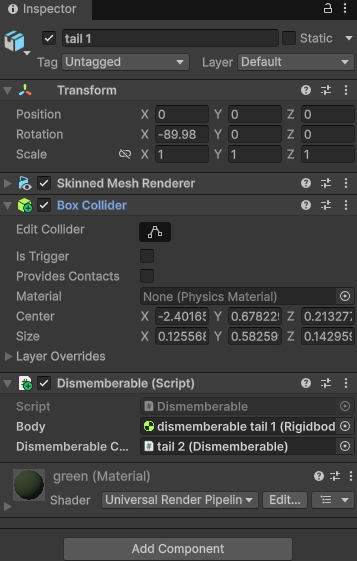
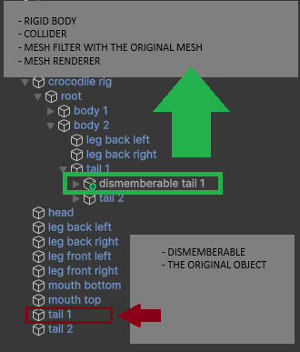

# Dismemberment
A simple yet scalable dismemberment system for Unity.

It raplaces the object you want to dismember with a rigid bodied coppy fo it.

Here we can see how two parts are dismebered separedly:

Now at the same time:

## How to use
1. Attach Dismemberable to the original object you want to dismember.
    - Each object you want to dismember should have one.

        
2. Asing the body field.
    - This will be a  copy of the orinal object with a rigidbody and a collider attach to it.
    - To make a copy of an object with a Skinned Mesh Renderer, the copy must have a simple Mesh Renderer and a Mesh filter with the same mesh asigned.
        
        
    - The copy should have the same parent bone as the original, so it moves like the original.
3. If the Dismemberable has a child that's also a Dismemberable, asing it.
    - This way it will dismember all the Dismemberable in cascade.
4. Find a way to call Dismember() on Dismemberable.
    - In my case I just ray cast from the camera to the mouse position.
